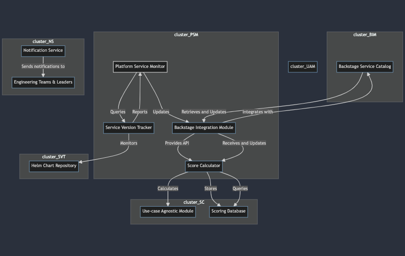
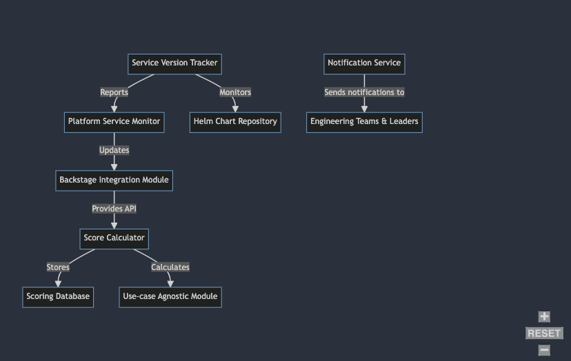

## System Architecture Diagram

---

## Detailed Description of Components

### Platform Service Monitor (PSM)

Periodically queries the Service Version Tracker (SVT) for the latest Helm chart version.
Retrieves the list of microservices from the Backstage service catalog.
For each microservice:
Retrieves its current version.
Compares it with the latest Helm chart version.
Sends the comparison result to the Score Calculator (SC).
Updates the Backstage Integration Module (BIM) with the calculated score.

### Backstage Integration Module (BIM)

Integrates the scoring system with Backstage's service catalog. It provides an API to update and retrieve service scores, allowing engineers to access service health information easily.

### Service Version Tracker (SVT)
Tracks changes in the Helm chart repository and monitors PRs for backward incompatible changes. It communicates with PSM for the latest Helm chart version and reports any detected changes.

### Score Calculator (SC)
Calculates a score for each microservice based on factors like backward incompatibility, time since last update, etc. It can be extended with use-case-specific modules for scoring related to security, monitoring standards, etc.

### Scoring Database (SDB)
Stores historical data of service scores, Helm chart versions, and other relevant metrics. It supports queries for trend analysis and reporting, providing insights into service health over time.

### Use-case Agnostic Module (UAM)
Modular extensions for use-case-specific scoring. Each module can independently enhance the scoring mechanism to evaluate aspects such as security compliance, monitoring standards, etc.

### Notification Service (NS)
Monitors critical events such as outdated services, security vulnerabilities, or inadequate monitoring standards. It sends notifications to engineering teams and leaders, prompting action to address identified issues.

---

## Assumptions Made

- **Consistency in Service Catalog:** Assuming that Backstage's service catalog is consistently updated and reflects the accurate list of microservices in the platform.
- **Platform Helm Chart Standardization:** Assuming that all microservices adhere to the standardized Helm chart structure defined by the platform team.
- **Communication Protocols:** Assuming the use of RESTful APIs or webhooks for communication between various components.
- **Scoring Algorithm Flexibility:** Assuming that the scoring algorithm is flexible and can be easily extended to accommodate additional use-case-specific modules.
- **Permission and Authentication:** Assuming proper authentication and permission mechanisms to ensure that only authorized entities can update or retrieve service scores.

---

## Flexibility and Scalability

- The solution is designed to be modular and extensible, allowing for future expansions and the inclusion of use-case-specific scoring modules.
- It can adapt to evolving requirements and accommodate changes in the platform or service health metrics.
- The architecture facilitates scalability to support a growing number of microservices and diverse use cases within the organization.

---

## Promotion of Service Health Understanding

- By providing a comprehensive scoring system integrated into the service catalog, the solution promotes a better understanding of service health among engineering teams.
- Clear visualization of service scores and associated metrics enables teams to prioritize actions and address issues proactively, improving overall service reliability and maintainability.

---
## How the Solution Solves the Challenge

**Automated Score Assignment:** The solution automatically assigns scores to services based on their adherence to platform standards, providing a quantitative measure of service health.

**Use-case Agnostic Scoring:** The solution is designed to accommodate use-case-specific scoring modules, allowing for the evaluation of additional metrics such as security compliance, monitoring standards, etc.

**Integration with Backstage:** The integration with Backstage's service catalog enables easy access to service health information for engineering teams.

**Notification Mechanism:** The notification service alerts engineering teams and leaders about critical events, prompting timely action to address identified issues.

## How the Solution Works

---
## Conclusion
The proposed solution provides a scalable and flexible architecture for automatically assigning scores to services based on their adherence to platform standards. 

It promotes a better understanding of service health among engineering teams and enables proactive measures to address identified issues. With modular components and use-case agnostic scoring, the solution can evolve to meet changing requirements and incorporate additional metrics for evaluation.